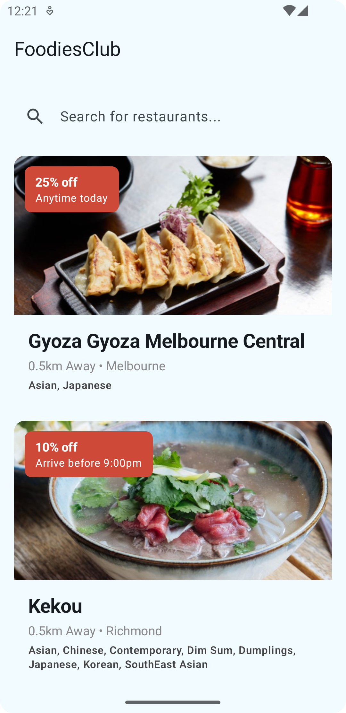
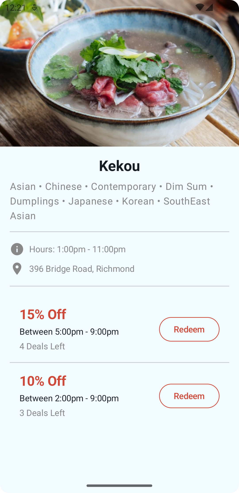

# FoodiesClub - EatClub Android Challenge

This is an Android application built as a technical challenge for the Senior Android Engineer role at EatClub. The app displays a list of restaurants and their associated deals from a remote JSON endpoint, allowing users to search for restaurants and view their specific deals.

## 📸 Screenshots

| Restaurant List Screen | Restaurant Detail Screen |
| :---: | :---: |
|  |  |

## ✨ Features

*   **Restaurant List:** Fetches and displays a list of restaurants from a remote API.
*   **Best Deal First:** Restaurants are automatically sorted by the highest discount deal available.
*   **Search Functionality:** Filter the list by restaurant name or cuisine type with a real-time search bar.
*   **Restaurant Details:** Tap on a restaurant to see its details and a full list of its available deals.
*   **Sorted Deals:** On the detail screen, deals are sorted by the highest discount first.

## 🛠️ Tech Stack & Architecture

This project is built with a 100% Kotlin, modern Android tech stack, emphasizing scalability, testability, and maintainability.

### High-Level Tech Stack

*   **UI:** [Jetpack Compose] for building the entire UI declaratively.
*   **Asynchronous Programming:** Kotlin Coroutines and Flow for managing background threads and handling streams of data.
*   **Architecture:** MVVM (Model-View-ViewModel) and Clean Architecture.
*   **Dependency Injection:** Hilt for managing dependencies throughout the app.
*   **Networking:** Retrofit for making network requests and Moshi for parsing JSON.
*   **Navigation:** Navigation Compose for navigating between screens.
*   **Image Loading:** Coil for loading and caching images from the network.

### High-Level Architecture

The application follows a clean, feature-based architecture that separates concerns into three distinct layers:

*   **`/data` (Data Layer):** Responsible for all data operations. This includes the Retrofit API service, DTOs (Data Transfer Objects) that match the API response, and the `RestaurantRepositoryImpl` which is the concrete implementation for fetching data.
*   **`/domain` (Domain Layer):** The core business logic of the app. It contains the clean data models (e.g., `Restaurant`, `Deal`), the repository *interface* (the contract), and the Use Cases (e.g., `GetRestaurantsUseCase`) that encapsulate specific business rules. 
*   **`/ui` (UI Layer):** The presentation layer of the app, built entirely with Jetpack Compose. It consists of ViewModels, Composable screens, and reusable UI components. The UI only interacts with the domain layer and is driven by state objects.

## 🧪 Testing

The project includes unit tests for the ViewModel layer to ensure the business logic and state management work as expected.

*   **Frameworks Used:** JUnit and [MockK](https://mockk.io/) (the standard for Kotlin).
*   **What's Tested:** The `RestaurantListViewModel` is tested to verify that the search and sorting logic correctly filters and orders the list of restaurants.
*   **How to Run:** To run the unit tests, execute the following command in your terminal at the project root:
    ```bash
    ./gradlew testDebugUnitTest
    ```

*Note: UI (Compose) tests and integration tests for the data layer were planned but have been omitted to keep the project within the challenge's time scope.*

## 🚀 How to Build and Run

1. **Open in Android Studio:** Open the project in a recent version of Android Studio (e.g., Hedgehog or newer).
2. **Gradle Sync:** Allow Gradle to sync and download all the required dependencies.
3. **Build the Project:** You can build the project from the menu (`Build` > `Make Project`).
4. **Run the App:** Select the `app` configuration and run it on an Android emulator or a physical device.

## ⚠️ Limitations & Assumptions

*   **No Offline Caching:** The app fetches data from the network every time it is launched. A production level implementation would include a database (like Room) to act as a single source of truth, providing offline support and a better user experience.
*   **UI Not Pixel Perfect:** The UI is implemented to be functionally correct, but it is not a pixel-perfect replica of pdf designs.
*   **Omitted Features:** Certain UI elements like the "Favourite" button and the "Menu/Call Us/Location" actions/UI have not been implemented.
*   **Basic Error Handling:** The app displays a simple text message for network errors. A more robust implementation would include more user-friendly error states (e.g., retry buttons, empty state screens).
*   **API Stability:** It is assumed that the provided JSON API endpoint is stable and its data structure is consistent.